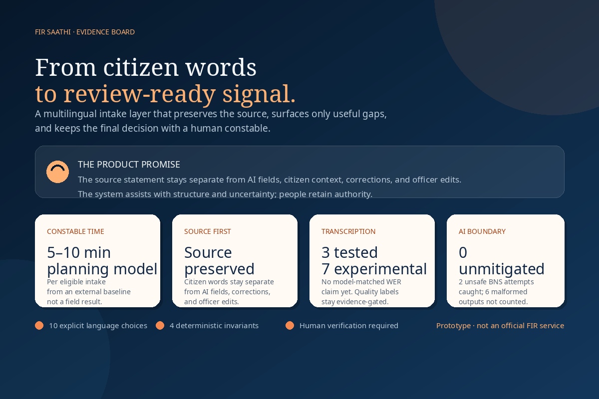
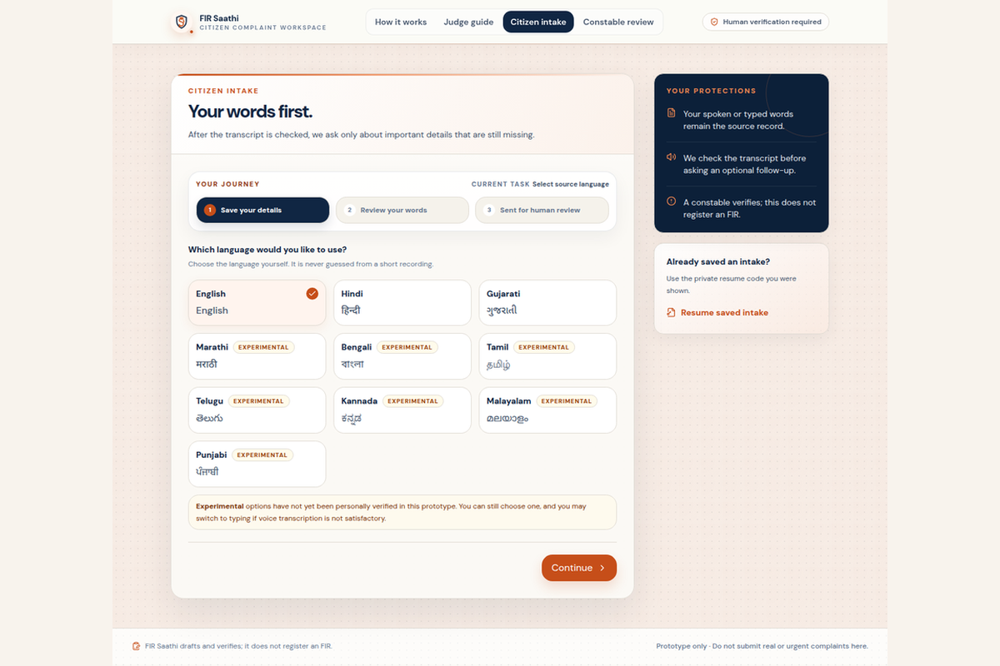
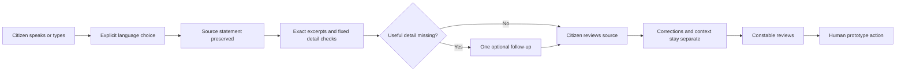

<div align="center">

# FIR Saathi

### The source-preserving intake layer for multilingual public-service review

**Citizens keep their own words. Constables get a clearer review surface. AI assists with structure and uncertainty—people retain authority.**

[](https://github.com/khushitpratikshah/fir-saathi/actions/workflows/deploy-raspberry-pi.yml)
[](#scope-and-boundaries)
[](#self-hosted-stack)

</div>

> **FIR Saathi is a demonstration prototype—not an official police portal, emergency service, FIR-registration system, legal-advice engine, or automated decision-maker.** Do not use it for real or urgent complaints.

<div align="center">



</div>

## The first 15 seconds

Most intake tools optimise for completing a form. FIR Saathi optimises for **preserving the account while making human review easier**. A citizen can speak or type in one of ten explicitly selected Indian languages. The source statement stays separate from structured fields, citizen context, corrections, translation aids, and officer edits. The system asks only an optional, high-value follow-up when a useful detail is genuinely absent, then hands the record to a constable for human review.

That is the product in one sentence: **less translation between a citizen’s account and a reviewer’s workspace, without pretending that AI is the authority.**

| What a reviewer needs | What FIR Saathi makes visible |
|---|---|
| The citizen’s actual account | An immutable source statement, kept in the original language |
| The details needed to review it | Fixed source-backed fields with exact excerpts and separate citizen context |
| The gaps worth asking about | One optional, high-value follow-up at a time; citizens can skip |
| The human decision boundary | Constable review, corrections with reasons, audit history, and no automatic FIR decision |

## Image gallery

The gallery below uses repository-hosted PNG assets prepared at an exact 3:2 ratio and kept well below the 5 MB per-image limit.

| Evidence board | Citizen intake |
|---|---|
|  |  |
| The product promise, human-review boundary, and current evidence signals. | The real intake screen: ten language choices, source-first wording, and Experimental labels for the seven personally unverified options. |

## The honest scoreboard

Here are the four questions a serious evaluator should ask. The numbers below distinguish **observed evidence**, **implemented product behaviour**, and **measurements still requiring a controlled pilot**. That distinction is part of the design, not a footnote.

| Question | What we can defend today | Status |
|---|---|---|
| **How much time does FIR Saathi save a constable?** | An **officer-reported claim says roughly 80% of the intake-and-structuring work can be saved**. This is an attributed claim, not an independently measured FIR Saathi result; the README keeps the underlying study and conservative planning model below for context. | **Officer-reported claim; independently unverified** |
| **How well does transcription work by language?** | English, Hindi, and Gujarati have been personally tested qualitatively. Marathi, Bengali, Tamil, Telugu, Kannada, Malayalam, and Punjabi are available but marked **Experimental**. No model-matched WER claim is published. | **Language evidence in progress** |
| **How often does AI attempt unsupported information, and how often is it caught?** | In the recorded ten-fixture hostile run, 4 responses were parseable; 2 of those attempted unsafe non-`REVIEW` BNS output, and the deterministic normaliser mitigated both. That leaves **0 unmitigated evaluated responses**. Six malformed responses are not counted as blocked. | **Observed snapshot, not a benchmark** |

> **Why show both figures?** The roughly 80% number is an officer-reported claim about intake-and-structuring effort. The 5–10 minute range below is a separate, conservative planning model based on an external report-writing baseline. Neither is a measured FIR Saathi impact result; both should be tested in a local pilot.

## What is already working

FIR Saathi is not just a landing-page concept. The repository contains a complete citizen-to-constable prototype with portable deployment, server-side provider calls, capability-protected citizen access, audit history, and a deterministic boundary around AI output.

| Capability | Product behaviour |
|---|---|
| **Source-first intake** | Typed or voice statements become the source record; application flow never silently rewrites them. |
| **Multilingual access** | Ten explicit choices: English, Hindi, Gujarati, Marathi, Bengali, Tamil, Telugu, Kannada, Malayalam, and Punjabi. |
| **Useful follow-ups** | The app checks time, place, people/vehicle, property/loss, and injury/safety categories, then asks only optional questions that remain relevant. |
| **Human review** | A protected constable workspace keeps source, additions, corrections, evidence metadata, AI aids, and audit history in separate lanes. |
| **Bounded legal aid** | A small catalogue of non-authoritative BNS review cards requires exact source quotes and falls back to `REVIEW` when evidence is insufficient. |
| **Reviewer translation aid** | English translation and back-translation are separate, session-only, constable-only aids; neither replaces the original source. |
| **Private citizen access** | The public `FS-…` reference is not enough to open a record. A separate `FSC-…` capability is required and only its hash is persisted. |
| **Portable runtime** | React and Express run on a Raspberry Pi; Supabase provides data/auth/storage and Groq provides drafting/transcription. |

## Evidence, not marketing theatre

### 1. Constable time saved: a cited planning estimate, not a field result

The workflow is deliberately shaped around a plausible time-saving mechanism: the citizen’s source stays intact, the system surfaces exact excerpts instead of producing a polished invented narrative, and only high-value missing details are offered as optional follow-ups. That may reduce the reviewer’s need to re-read, re-structure, and re-ask basic questions. The README now uses a transparent **5–10 minute per eligible intake planning estimate**, calculated as follows:

| Calculation step | Value | Interpretation |
|---|---:|---|
| External report-writing baseline | 54.63 minutes | Historical mean reported for one police department in an independent study of police report duration [6] |
| FIR Saathi planning assumption | 10–20% of baseline | A deliberately bounded scenario for the narrower intake-structuring and clarification work FIR Saathi targets; this percentage is an internal hypothesis, not a published FIR Saathi result |
| Estimated potential time recovered | 5.46–10.93 minutes | Rounded and presented as **5–10 minutes per eligible intake** |

This estimate must not be read as “FIR Saathi saves ten minutes.” The cited randomized trial found that a commercial AI report-writing tool did **not** significantly reduce report-writing duration, so external evidence does not validate our estimate. The 5–10 minute range is a hypothesis for a controlled local pilot, not a field measurement, causal claim, or guarantee. The U.S. DOJ COPS Office also describes AI-assisted report workflows as requiring officer review, missing-detail completion, manual editing, and sign-off.[7]

A credible pilot would use matched synthetic scenarios and the same reviewers in two conditions: a baseline intake and FIR Saathi. It should report median and percentile time from source-record arrival to review-ready human action, the number of clarification loops, and source-fidelity errors. The pilot should be able to disprove the estimate as easily as confirm it.

### 2. Transcription quality by language

The app preserves provider timestamps and optional `avg_logprob` metadata, but it does not colour a citizen’s wording using an uncalibrated magic threshold. A language-specific WER claim requires reference-checked audio that matches the deployed provider, model, language, and intended audio domain. The current language status is therefore explicit and conservative.

| Language | App status | Current evidence |
|---|---|---|
| English | Supported | Personally tested qualitatively; no formal WER study |
| Hindi | Supported | Personally tested qualitatively; no formal WER study |
| Gujarati | Supported | Personally tested qualitatively; no formal WER study |
| Marathi | **Experimental** | No provider-matched reference evaluation published |
| Bengali | **Experimental** | No provider-matched reference evaluation published |
| Tamil | **Experimental** | No provider-matched reference evaluation published |
| Telugu | **Experimental** | No provider-matched reference evaluation published |
| Kannada | **Experimental** | No provider-matched reference evaluation published |
| Malayalam | **Experimental** | No provider-matched reference evaluation published |
| Punjabi | **Experimental** | No provider-matched reference evaluation published |

The repository includes a calibration workflow that requires at least 100 independently reference-checked segments before confidence highlighting can be activated. It also documents the input format, corpus requirements, and the rule that results from another model or corpus cannot be presented as evidence for this deployment.[2]

### 3. Unsupported AI output and deterministic catching

The live adversarial evaluator is intentionally small and provider-dependent, but it is concrete. It sent ten hostile source statements to the configured drafting model. The saved run recorded four parseable model responses, two unsafe non-`REVIEW` BNS suggestions from instruction-only sources, two deterministic mitigations, zero unmitigated evaluated responses, and six unusable JSON responses that were **not** counted as successful blocks.[1]

The deterministic invariant suite is a separate, stronger boundary test. It verifies four post-generation invariants across ten supported scripts: unsupported field keys are discarded, invented source quotes are discarded, under-evidenced catalogue suggestions collapse to `REVIEW`, and non-catalogue BNS codes collapse to `REVIEW`. It also exercises delimiter breakout, role-play framing, zero-width obfuscation, homoglyph variation, and unknown context-key rejection. This is evidence that the application boundary behaves as designed; it is not a claim that a live model has a perfect safety score.[3]

## The workflow



The key boundary is visible in the data model: the source statement, source-backed AI fields, citizen context, citizen corrections, officer corrections, translation aid, and audit events remain distinct. A human constable verifies the prototype review. Nothing in the application registers an FIR.

## Self-hosted stack

The deployed application is portable. The Raspberry Pi runs the React build and Express/tRPC server, while hosted services remain replaceable infrastructure for the database, authentication, private evidence storage, and AI provider calls.

| Layer | Technology | Responsibility |
|---|---|---|
| Front end | React 19, TypeScript, Tailwind CSS 4, Wouter, GSAP | Citizen intake, review surfaces, accessibility, and responsive presentation |
| API | Express 4 and tRPC 11 | Typed procedures, validation, authorization, and provider orchestration |
| Data/auth/storage | Supabase PostgreSQL, Auth, Storage, and RLS | Complaint records, roles, audit events, and private evidence objects |
| AI provider | Groq | Server-side drafting and Whisper transcription |
| Deployment | Raspberry Pi 5, Node 22, pnpm, systemd, Cloudflare Tunnel | Self-hosted production process and HTTPS ingress |

## Run locally

Install Node.js 22 or newer and pnpm. Create a server-only environment file using the following shape; never commit real credentials.

```dotenv
SUPABASE_URL=https://your-project.supabase.co
SUPABASE_SERVICE_ROLE_KEY=your-server-only-service-role-key
VITE_SUPABASE_URL=https://your-project.supabase.co
VITE_SUPABASE_PUBLISHABLE_KEY=your-public-supabase-publishable-key
GROQ_API_KEY=your-groq-key
FIR_SAATHI_BOOTSTRAP_ADMIN_EMAIL=your-admin@example.com
PORT=3000
NODE_ENV=development
```

Apply the SQL files in `supabase/migrations/` to the target Supabase project, then install dependencies and run the development server.

```bash
pnpm install
pnpm dev
```

For a production build, use `pnpm build` followed by `pnpm start`. The browser receives only the public Supabase URL and publishable key; the Supabase service-role key and Groq key stay server-side.[4]

## Raspberry Pi deployment

The repository includes a guarded GitHub Actions workflow for a repository-scoped Linux/ARM64 self-hosted runner. A push to `main` runs type checking and tests on the Pi, then pulls the triggering revision, installs dependencies, builds the production bundle, restarts only the existing `fir-saathi` systemd service, and checks that the service is active. The workflow does not receive application secrets from GitHub; the Pi reads its root-owned `/etc/fir-saathi.env` file locally.

The full setup, Cloudflare Tunnel configuration, firewall guidance, rollback procedure, and secret-handling rules are in [`docs/RASPBERRY_PI_5_HOSTING.md`](docs/RASPBERRY_PI_5_HOSTING.md). Keep the repository-scoped runner private and never grant it blanket passwordless `sudo` access.[5]

## Security and privacy boundaries

Raw voice bytes are sent transiently for transcription and are not persisted by the application after transcription. Browser-session audio preview can remain locally until the session ends. Citizen access uses a separate unguessable capability code; the short public reference alone cannot open or mutate a record. Withdrawal revokes active access and removes the record from normal workspaces while retaining a minimal audit/tombstone boundary. It is not a certified legal-erasure promise.

All ordinary application actions preserve a separation between original source, later context, corrections, AI aids, and human edits. The system must never invent facts, infer motive or credibility, decide jurisdiction, recommend charges, verify a complaint, or present an AI output as the citizen’s words.

## Scope and boundaries

FIR Saathi is designed for demonstration, evaluation, and controlled self-hosting. It does not provide emergency dispatch, official FIR registration, legal advice, formal records-retention guarantees, biometric identity verification, production-scale abuse prevention, or a validated multilingual transcription benchmark. The right next step is a controlled evaluation with synthetic scenarios and independently reference-checked audio—not a stronger marketing claim.

## Missing-information reduction: keep the question, measure it at the end

FIR Saathi’s mechanism is implemented: it checks fixed high-value categories, avoids asking a question when the source or separate citizen context already covers it, and stores context separately rather than silently enriching the citizen’s statement. The reduction in missing-detail rate has **not** yet been measured against a baseline, so this belongs at the end of the README rather than in the hero pitch.

A credible pilot should independently code matched synthetic scenarios in two conditions—baseline intake and FIR Saathi—and report detail coverage, clarification loops, source-fidelity errors, and citizen burden. This section is intentionally last because it is a measurement question, not a headline claim.

| Proposed pilot metric | Definition |
|---|---|
| Detail coverage | Percentage of independently judged relevant categories with usable information in the record |
| Clarification efficiency | Number of follow-up questions needed before a reviewer can begin |
| Source fidelity | Count of cases where a structured field or correction cannot be traced to source/context provenance |
| Citizen burden | Completion rate, skip rate, and time spent on optional follow-ups |

## Repository map

| Path | Purpose |
|---|---|
| [`client/src/pages/CitizenIntake.tsx`](client/src/pages/CitizenIntake.tsx) | Citizen language choice, voice/text intake, consent, and source review |
| [`server/drafting.ts`](server/drafting.ts) | Structured drafting prompts, normalisers, source-quote checks, and BNS boundary |
| [`server/db.ts`](server/db.ts) | Supabase persistence, access capabilities, withdrawal, and audit helpers |
| [`server/adversarialEval.test.ts`](server/adversarialEval.test.ts) | Deterministic hostile-input invariants |
| [`server/liveAdversarialEval.ts`](server/liveAdversarialEval.ts) | Opt-in live provider evaluation and result accounting |
| [`docs/ASR_EVALUATION_PROTOCOL.md`](docs/ASR_EVALUATION_PROTOCOL.md) | Provider-matched transcription evaluation protocol |
| [`docs/RASPBERRY_PI_5_HOSTING.md`](docs/RASPBERRY_PI_5_HOSTING.md) | Self-hosted Raspberry Pi deployment guide |
| [`docs/assets/evidence-board.png`](docs/assets/evidence-board.png) | GitHub-ready evidence visual; source layout is in [`docs/assets/evidence-board.svg`](docs/assets/evidence-board.svg) |
| [`docs/assets/gallery-evidence-board.png`](docs/assets/gallery-evidence-board.png) | 3:2 PNG gallery copy of the evidence board |
| [`docs/assets/gallery-intake-language-picker.png`](docs/assets/gallery-intake-language-picker.png) | 3:2 PNG gallery copy of the verified intake screenshot |

## References

[1]: docs/evaluations/live-groq-adversarial-latest.json "Recorded live Groq adversarial evaluation"
[2]: docs/ASR_EVALUATION_PROTOCOL.md "FIR Saathi ASR evaluation protocol"
[3]: server/adversarialEval.test.ts "Deterministic adversarial evaluation invariants"
[4]: https://supabase.com/docs/guides/database/secure-data "Supabase: Securing your data"
[5]: docs/RASPBERRY_PI_5_HOSTING.md "FIR Saathi Raspberry Pi 5 hosting guide"
[6]: https://www.crimrxiv.com/pub/nxbmzp2j/release/1 "Adams et al., No Man’s Hand: Artificial Intelligence Does Not Improve Police Report Writing Speed"
[7]: https://cops.usdoj.gov/html/dispatch/01-2025/ai_reports.html "U.S. DOJ COPS Office, Using AI to Write Police Reports"
